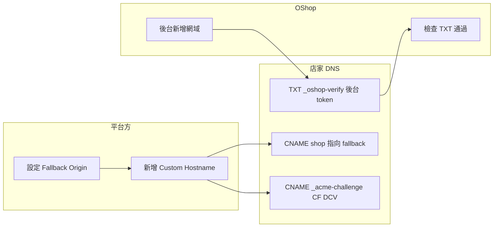

# 自訂網域上線指引（Cloudflare for SaaS × OShop 後台）

本文說明 **兩套系統** 如何一起做完，網址才會正常、HTTPS 才會有憑證：

| 層級 | 目的 | 誰負責 | 典型 DNS / 設定 |
|------|------|--------|-----------------|
| **A. Cloudflare for SaaS** | 邊界 HTTPS、把 `shop.客戶網域` 流量轉到妳的來源站 | **平台方**（Cloudflare + 來源） | Fallback Origin、Custom Hostname、（可選）`_acme-challenge` DCV |
| **B. OShop 後台「自訂網域」** | 資料庫認定「這個 hostname 屬於哪一間店」 | **店家** 操作後台 + DNS | TXT `_oshop-verify.{hostname}` |

兩者 **都要完成**，缺一不可：  
- 只做 **A**：可能有憑證，但應用查不到租戶（或錯店）。  
- 只做 **B**：後台顯示已驗證，但瀏覽器連線可能 1001 / 無 TLS。  

**後台「設定 → 自訂網域」**：部署時將 **Fallback Origin 的完整主機名** 設入 `NUXT_PUBLIC_SAAS_CNAME_TARGET`（與 Cloudflare 後台逐字相同），租戶 CNAME 就填這個值。可選 `NUXT_PUBLIC_SAAS_SUPPORT_DOC_URL`。詳見 `.env.example` 與下方「租戶 CNAME 填什麼」。

---

## 租戶的「流量 CNAME」要填什麼？（給平台方）

**答案只有一個：** 與你在 **Cloudflare → SSL/TLS → Custom Hostnames** 裡設定的 **Fallback Origin** **完全一致**的那個 FQDN（例如 `origin.shopgo.com.hk`）。

| 角色 | 要做的事 |
|------|----------|
| **你（平台）** | ① 在 **shopgo 的 zone** 建一筆 **橘雲** DNS（例：`origin` → 指向真實伺服器）。② Custom Hostnames 頁的 **Fallback Origin** 填入 **`origin.shopgo.com.hk`**（與該 DNS 主機名相同）。③ 把同一串字放進部署環境 **`NUXT_PUBLIC_SAAS_CNAME_TARGET`**，後台指引會顯示給租戶。 |
| **租戶** | 在他的 DNS 設：`shop`（或完整子網域）**CNAME →** `origin.shopgo.com.hk`（即你環境變數裡的那個值）。**不要**填 `shopgo.com.hk`，除非那筆記錄正好是你要的 Fallback（一般不建議）。 |

若未設 Fallback Origin 或租戶指錯目標，容易出現 **Cloudflare 1001**。

---

## 一、平台方一次性設定（Cloudflare）

### 1.1 Fallback Origin（必做）

儀表板提示：**在 Custom Hostname 完成驗證前，必須先啟用 Fallback Origin。**

1. 在 **賣家平台** 的 zone（例如 `shopgo.com.hk`）新增一個 **橘雲（Proxied）** 的 DNS 名稱，指向真實 **來源站**（跑 Nuxt 的那台／那個 IP）。  
   - 例：`origin.shopgo.com.hk` → A 或 CNAME 至你的伺服器。  
2. 到 **SSL/TLS → Custom Hostnames（Cloudflare for SaaS）**，在 **Fallback Origin** 欄位填入該主機名（如 `origin.shopgo.com.hk`），按 **Add Fallback Origin**。  
3. 確認該名字在 DNS 上 **已是 Proxied**，且來源 **健康**（`curl -I https://origin.shopgo.com.hk` 能通，或與你實際部署一致）。

> **注意**：這筆是「平台 zone」上的記錄，不是店家網域上的記錄。

### 1.2 在 Cloudflare 註冊「客戶網域」為 Custom Hostname（必做）

店家要用的主機名（例：`shop.yching.hk`）必須出現在 **Custom Hostnames** 列表裡：

- 在儀表板按 **Add Custom Hostname**，hostname 填 **`shop.yching.hk`**（完整 FQDN）。  
- 憑證類型依需求選擇（常見：Cloudflare 代管 DV）。  
- 儀表板會顯示 **Hostname status**、**Certificate status**；未完成前可能為 *Pending*。

**自動化（可選）**：同一頁下方的 API 可用於之後由後台呼叫  
`POST /client/v4/zones/{zone_id}/custom_hostnames` 建立（需 API Token 權限）。

### 1.3 DCV（憑證驗證）— `_acme-challenge` 與流量 CNAME **不同**

為了替 `shop.yching.hk` 簽 **HTTPS 憑證**，Cloudflare 常要求店家另加一筆 **DCV** CNAME（畫面上的 **DCV Delegation**），格式通常為：

```text
_acme-challenge.shop   CNAME   shop.yching.hk.<你帳戶專用>.dcv.cloudflare.com
```

- **名稱** 可能是 `_acme-challenge.shop` 或完整 `_acme-challenge.shop.yching.hk`（依 DNS 面板而定）。  
- **目標** 以 **Custom Hostname `shop.yching.hk` 的詳情頁** 為準（例如 `*.daff.dcv.cloudflare.com` 這類，**每個帳戶／主機名可能不同**）。  
- 這一筆只負責 **憑證**；**流量**仍靠上一節的 **shop → Fallback Origin**。

上一節流量 CNAME **不要**填成 `dcv.cloudflare.com` 那串——那是憑證驗證專用。

---

## 二、店家端：OShop 後台「自訂網域」

路徑：**租戶後台 → 設定 → 自訂網域**。

1. 輸入要綁定的 **完整 hostname**（例：`shop.yching.hk`，不要加 `https://`）。  
2. 按 **新增** 後，後台會顯示 **TXT 驗證** 資訊（本系統用來寫入資料庫 `tenant_custom_domains`）：  
   - **名稱**：`_oshop-verify.shop.yching.hk`（即 `_oshop-verify.` + 你的 hostname）  
   - **值**：畫面上的一長串 **verificationToken**  
3. 在 DNS 供應商新增對應 **TXT**，等待傳播後按 **檢查驗證**。  
4. 通過後，應用層才會在 `Host: shop.yching.hk` 時解析到正確租戶；可抽查：`https://shop.yching.hk/api/store/host-context` 應回 `{"shopSlug":"…"}`。

---

## 三、店家 DNS 總表（建議直接貼給客戶）

以下以 **`shop.yching.hk`** 為例，實際名稱請替換。

| 類型 | 主機／名稱（依供應商介面） | 值／目標 | 用途 |
|------|---------------------------|----------|------|
| **CNAME** | `shop`（或 `shop.yching.hk`） | **等於 Cloudflare Fallback Origin**（例 `origin.shopgo.com.hk`）；須與平台 `NUXT_PUBLIC_SAAS_CNAME_TARGET` 相同。**勿**用首頁 `shopgo.com.hk` 代替，除非你已把首頁記錄也設成 Proxied 且 CF 後台 Fallback 就是它（少見）。 | 流量進 SaaS，降低 **1001** |
| **TXT** | `_oshop-verify.shop` 或完整 `_oshop-verify.shop.yching.hk` | OShop 後台顯示的 **verificationToken** | **租戶歸屬**（OShop DB） |
| **CNAME** | `_acme-challenge.shop` | Cloudflare **Custom Hostname** 詳情頁給的 **DCV 目標** | **HTTPS 憑證**（Cloudflare） |

TTL 可先用 Auto／300；變更後全球生效可能數分鐘至 48 小時。

---

## 四、端到端順序建議（平台 + 店家）



建議順序：

1. **平台**：Fallback Origin → 確認來源可連線。  
2. **平台**：新增 Custom Hostname `shop.yching.hk`。  
3. **店家**：在 DNS 加上 **CNAME**（shop → 平台指定目標）與 **DCV CNAME**（若 CF 仍顯示未完成）。  
4. **店家**：後台 **自訂網域** 新增同一 hostname → 加 **TXT** `_oshop-verify` → **檢查驗證**。  
5. 待 CF **Certificate status = Active**、後台 **已驗證**，再請店家用瀏覽器開 `https://shop.yching.hk`。

---

## 五、與 Error 1001 的對應

| 現象 | 常見原因 |
|------|----------|
| **1001 DNS resolution error** | `yching.hk` 下 **沒有** `shop` 的 **CNAME**；或 CNAME **指錯**（未指向平台给的 Fallback／SaaS 目標）；或 **Fallback Origin 未設定**；或 DNS 尚未傳播。 |
| 有憑證但開站錯誤／404 租戶 | **OShop TXT** 未做或未完成 **檢查驗證**。 |
| 後台已驗證但瀏覽器憑證警告 | **Custom Hostname** 或 **DCV** 未完成。 |

---

## 六、後台與 Cloudflare API 的配合（進階）

目前 OShop 後台**只**管理 **層級 B**（租戶、`verified_at`、`_oshop-verify`）。  
**層級 A**（在 CF 建立 `custom_hostnames`）可選：

- **現況**：平台管理員在 CF 儀表板 **手動** Add Custom Hostname（與 API 範例相同效果）。  
- **之後若要自動化**：在店家按下「檢查驗證」且 TXT 通過後，由伺服器以 **Cloudflare API** 建立／查詢 Custom Hostname（需 `ZONE_ID`、具權限的 **API Token**、勿把 Token 寫進前端）。

---

## 七、README／對外一句話

可對店家說：

> 請在 DNS 依序完成三件事：**(1)** 依平台信件將 `shop` **CNAME** 到我們提供的主機名；**(2)** 在 Cloudflare／憑證驗證信裡的 **`_acme-challenge`** 紀錄；**(3)** 在商店後台「自訂網域」完成 **TXT** 驗證。三者都綠燈後，HTTPS 與商店對應才會一併生效。

---

**相關文件**：`docs/manual-test-tenant-customer-flow.md` §G（含本機略過 DNS 的測試方式）。  
**Cloudflare 官方**：[Error 1001](https://developers.cloudflare.com/support/troubleshooting/http-status-codes/cloudflare-1xxx-errors/error-1001/)、[SSL for SaaS / Custom Hostnames](https://developers.cloudflare.com/cloudflare-for-platforms/cloudflare-for-saas/).
